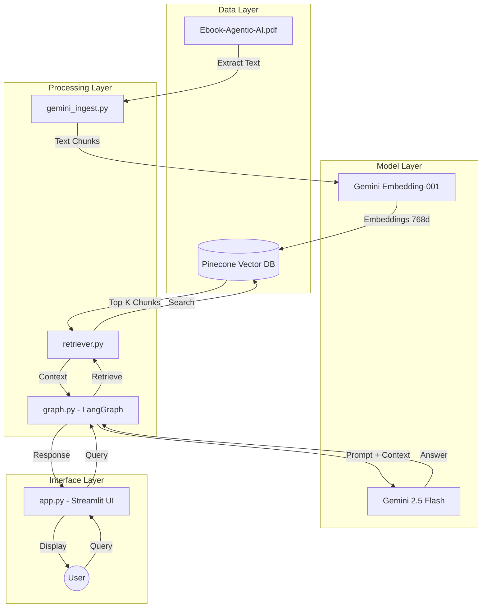

# 🤖 RAG Chatbot - Agentic AI Expert

A production-ready RAG chatbot that answers questions about Agentic AI using LangGraph, Pinecone, and Gemini.

## i have also a journey.md file to showcase all things i thought / whole process and other things

## Demo
https://github.com/user-attachments/assets/a75351e1-2170-44f5-a651-937f6c77d88e


## 🏗️ System Architecture



## 📦 Tech Stack

- **Document Processing:** PyPDF (text extraction)
- **Embeddings:** Gemini Embedding-001 (768d)
- **Vector DB:** Pinecone
- **LLM:** Gemini 2.5 Flash (via OpenRouter)
- **Framework:** LangGraph
- **UI:** Streamlit

## 🚀 Installation

### 1. Install Dependencies
```bash
pip install -r requirements.txt
```

### 2. Environment Variables
Create a `.env` file:
```env
GOOGLE_API_KEY=your_gemini_api_key
PINECONE_API_KEY=your_pinecone_api_key
OPENROUTER_API_KEY=your_openrouter_api_key
```

### 3. Project Structure
```
chatbot/
├── src/
│   ├── gemini_ingest.py      # PDF ingestion
│   ├── retriever.py           # Pinecone retrieval
│   ├── graph.py               # LangGraph RAG pipeline
│   ├── prompts.py             # Prompt templates
│   └── app.py                 # Streamlit UI
├── data/
│   └── Ebook-Agentic-AI.pdf   # Knowledge base
├── .env                        # Environment variables
└── requirements.txt
```

## 🎯 Usage

### Step 1: Ingest PDF
```bash
python src/gemini_ingest.py
```

This will:
1. Extract text from PDF using PyPDF
2. Chunk text (1000 chars, 200 overlap)
3. Generate embeddings with Gemini
4. Store in Pinecone

**Note:** Takes ~5-10 minutes for a 60-page PDF.

### Step 2: Run Chatbot
```bash
streamlit run src/app.py
```

### Step 3: Ask Questions!
Try these:
- "Explain the BDI Model"
- "How does Agentic AI differ from Traditional AI?"
- "What are the challenges of orchestrating MAS?"
- "What is the role of the Orchestrator?"

## 📊 Sample Queries

### Example 1: Technical Concepts
```
Q: Explain the BDI Model and how it drives agent behavior
A: The BDI (Beliefs, Desires, and Intentions) model is a common 
   model in agent-oriented programming where agents are characterized 
   by their beliefs (information about the world), desires (goals), 
   and intentions (plans of action)...

Confidence: 0.74
Context: 8 chunks retrieved from pages 21, 32, 19
```

### Example 2: Use Cases
```
Q: What are practical applications of Agentic AI in healthcare?
A: Agentic AI in healthcare includes patient monitoring systems that 
   track vitals and alert providers, personalized treatment plans 
   based on patient data analysis...

Confidence: 0.68
Context: 8 chunks retrieved from pages 8-10
```

## 🎨 Features

### Clean UI
- Simple chat interface
- Chat history maintained
- Confidence scores displayed
- Context viewer in JSON format

### RAG Pipeline
```
Query → Embed → Search Pinecone → Retrieve Top-8 
→ Format Prompt → LLM Generate → Calculate Confidence → Return
```

### Confidence Scoring
- Based on average of top 3 similarity scores
- Range: 0.0 - 1.0
- Helps assess answer reliability

## 🔧 Configuration

### Adjust Retrieval
In `graph.py`:
```python
# Retrieve more chunks
retrieve_context(query, top_k=12)  # default: 8
```

### Change Chunk Size
In `gemini_ingest.py`:
```python
splitter = RecursiveCharacterTextSplitter(
    chunk_size=1500,      # default: 1000
    chunk_overlap=300,    # default: 200
)
```

### Change Models
In `graph.py`:
```python
chat_model = ChatOpenAI(
    model='google/gemini-2.0-flash-exp',  # or any other model
)
```

## 📈 Performance

### Ingestion
- **60-page PDF:** ~5-10 minutes
- **Total chunks:** ~500-800
- **Batch size:** 20 chunks/batch
- **Rate limiting:** 2s between batches

### Query
- **Retrieval:** ~1 second
- **Generation:** ~2-3 seconds
- **Total:** ~3-5 seconds per query

## 🐛 Troubleshooting

### "API NOT FOUND"
Check your `.env` file has all required keys:
```env
GOOGLE_API_KEY=...
PINECONE_API_KEY=...
OPENROUTER_API_KEY=...
```

### "Index not found"
Run ingestion first:
```bash
python src/gemini_ingest.py
```

### "Rate limit exceeded"
Increase sleep time in `gemini_ingest.py`:
```python
time.sleep(5)  # default: 2
```

### "No relevant documents found"
- Check if ingestion completed successfully
- Verify Pinecone index has documents
- Try broader/simpler queries

## 📝 How It Works

### 1. Ingestion Pipeline
```
PDF → PyPDFLoader → Text Extraction 
→ RecursiveCharacterTextSplitter → Chunks 
→ Gemini Embeddings → Pinecone Storage
```

### 2. Query Pipeline
```
User Query → Gemini Embedding 
→ Pinecone Similarity Search 
→ Top-K Chunks Retrieved 
→ Format with RAG Prompt 
→ Gemini LLM Generation 
→ Answer + Confidence
```

### 3. LangGraph Nodes
1. **Retrieve Node:** Get context from Pinecone
2. **Generate Node:** LLM creates answer
3. **Confidence Node:** Calculate score

## 🎯 Key Files Explained

### `gemini_ingest.py`
- Loads PDF and extracts text
- Splits into chunks
- Generates embeddings
- Uploads to Pinecone in batches

### `retriever.py`
- Connects to Pinecone
- Performs similarity search
- Returns serialized + structured context

### `graph.py`
- Defines LangGraph state machine
- Orchestrates retrieve → generate → confidence flow
- Returns ChatResponse object

### `app.py`
- Streamlit UI
- Chat interface
- Displays answers + confidence + context
- Maintains chat history

### `prompts.py`
- RAG prompt template
- Instructs LLM to answer based only on context
- Includes output formatting guidelines

## 🤝 Contributing

Improvements welcome! Focus areas:
- Prompt engineering
- Chunk size optimization
- UI enhancements
- Error handling

## 📄 License

MIT License - use freely!

## 🙏 Acknowledgments

- Google Gemini for embeddings and LLM
- Pinecone for vector storage
- LangChain/LangGraph for RAG framework
- Streamlit for UI

---

**Built for an assignment that's not that deep bro** 🔥
